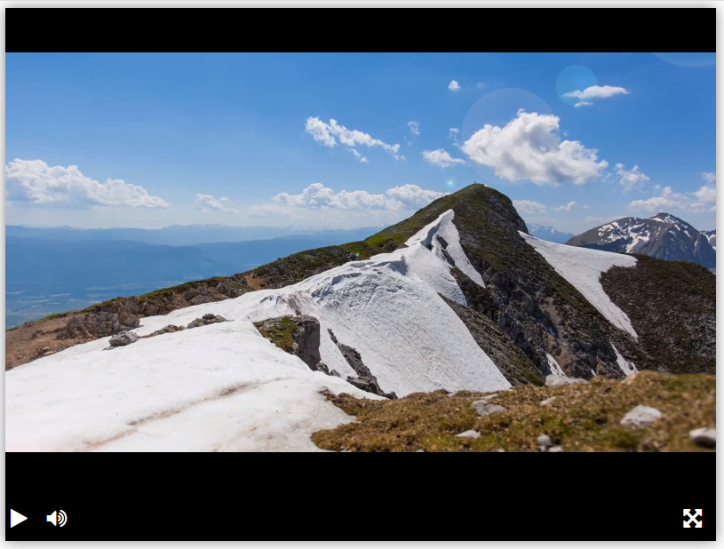

# Прототип плеера для воспроизведения видео в браузере



Плеер оснащен кнопками для запуска и остановки воспроизведения видео, включения и выключения звука, полноэкранного режима.

Воспроизводится видео по [этой ссылке](https://dvmn.org/media/filer_public/78/db/78db3456-3fd3-4504-9ed9-d2d1fd843c0b/highest_peak.mp4).


## Как запустить

Скачать файлы из репозитория и открыть `index.html` c помощью браузера.

[Пример работы плеера](https://piar1986.github.io/video_player/)

Если хочется выбрать другое видео, то в файле `index.html` с помощью аргумента `src` плееру можно указать какое видео проигрывать, ссылки обязаны заканчиваться расширением файла:

```html
<script type="text/javascript">
  createPlayer({
    elementId: 'player',
    src: 'https://dvmn.org/media/filer_public/d0/16/d016d9b8-4180-4bb9-ad83-0241f61627b8/samsung_demo_-_alive_in_color.mp4'
});
</script>
```

## Цель проекта

Код написан в образовательных целях на онлайн-курсе для веб-разработчиков [dvmn.org](https://dvmn.org/).